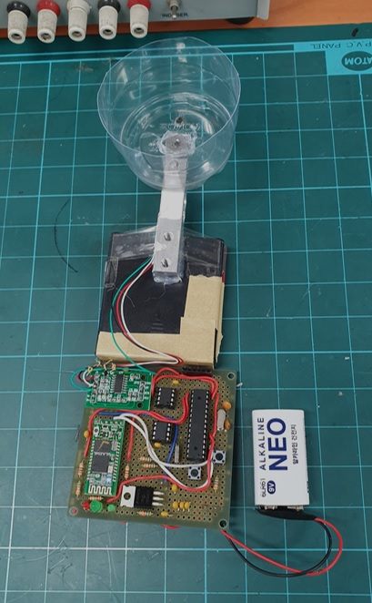
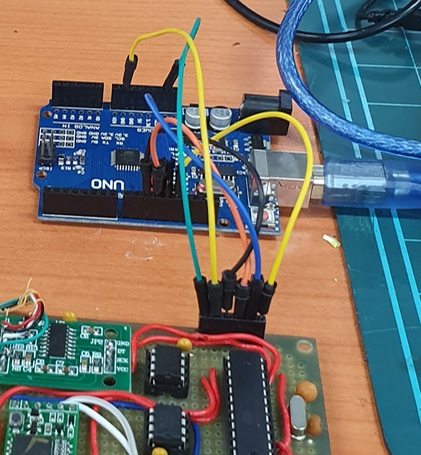
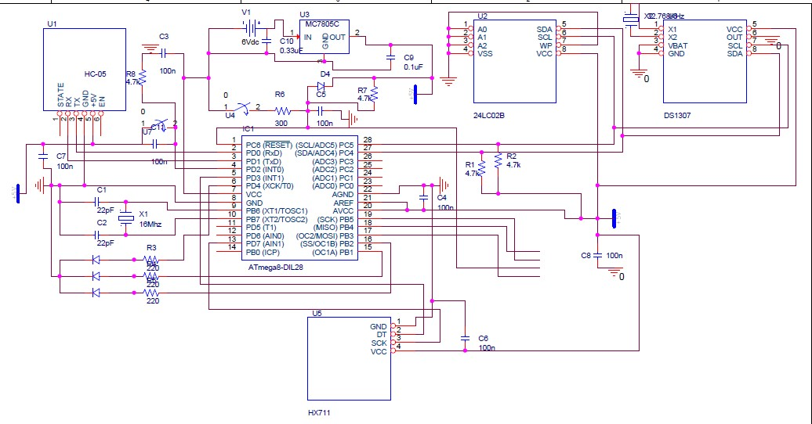
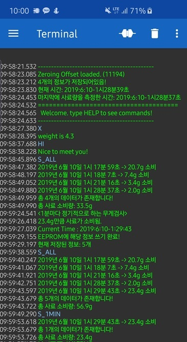

# 반려동물 사료통 무게 모니터링 기계

## 사진


## MCU and Peripherals
- MCU: ATMEGA328P-PU

- Bluetooth: HC-05 (UART)

- Real Time Clock Module: DS1307 (I2C)

  VBAT에 3.3V 인가시 300nA로 이용가능.

- EEPROM: 24LC02B (I2C)
  
  더 높은 용량 사용가능

- LOAD CELL: YZC-131A(5kg)

- ADC: HX711(24bit)

## 개발환경


Arduino Uno를 Arduino as ISP로 이용해서 업로드

ISP 핀은 하단의 Schematic 참조

## Schematic


우측 하단 4개의 핀을 ISP 업로드 용으로 사용

## 스크린샷


## LEDs
첫번째 LED(적색): BUSY

두번째 LED: FEED MODE ON/OFF

세번째 LED: 사료 변화량 측정 중 (OFF일때 특정 시간이 지나고 자동으로 ON이 되거나 CW 명령어로 활성화 가능)

## 사용법
9V 배터리 전원 인가 후 방치해 두면 사료 소모량 측정
블루투스 시리얼 터미널 어플리케이션 안드로이드 설치 후 HC-05 연결, 그 후 하단의 명령어 입력으로 제어가능.

사료 배급/조정 시 해당 변화량이 사료 소모량에 영향을 안 주기 위해서는 MCU 우측 버튼으로 FEED MODE를 ON/OFF 해야한다.

## 명령어

```
respond("< 명령어들 >");
respond("==== 일반 ====");
respond("HI: say hello to system!");
respond("CT: 현재 시스템 시간을 보여줍니다.");
respond("IT: 시계를 0:0:0-0:0:0으로 초기화합니다. ");
respond("ST: 시스템 시간을 수동으로 설정합니다.");
respond("ZERO: 영점 조절을 합니다. 조절 후 OFFSET 값을 EEPROM에 저장합니다.");
respond("X: 현재 무게 측정값을 출력합니다.");
respond("RESET: EEPROM에 저장된 모든 정보를 초기화합니다.");
respond("GD: 현재 사료 소비량을 계산합니다.");
respond("CW: 현재 사료 소비량을 EEPROM에 저장하고 초기화 시킵니다.");
respond("==== 통계 ====");
respond("S_1MIN: 최근 1시간동안의 사료 소비량을 출력합니다.");
respond("S_1HOUR: 최근 6시간동안의 사료 소비량을 출력합니다.");
respond("S_1DAY: 최근 하루동안의 사료소비량을 출력합니다.");
respond("S_ALL: 저장되어있는 모든 소비 데이터를 출력합니다.");
```
메모리 용량 부족으로 showHelper()안에서 주석처리

## 이슈
 - 타임스탬프 월/년 단위 오류
 - EEPROM에 최대 256개 까지 밖에 저장 못함. 소스 코드 최하단 주석 참조.
 - 버퍼 오버플로우


작성 중